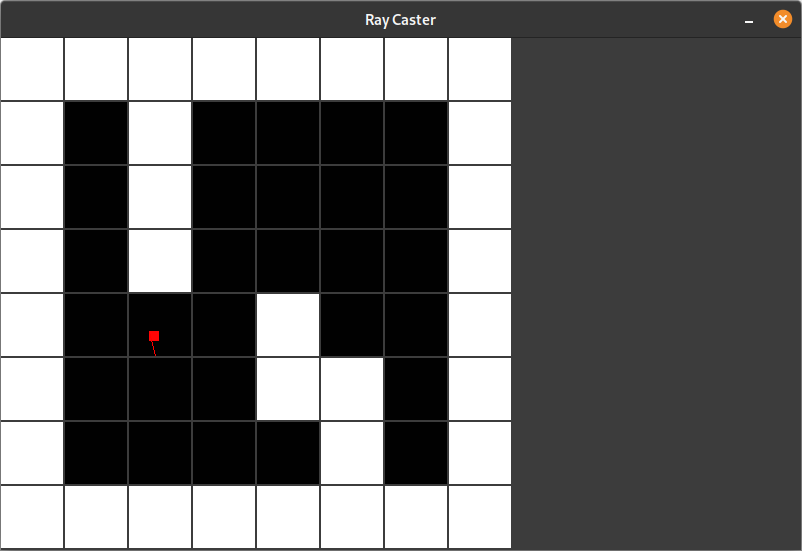

# Raycaster
A simple raycaster (not finished yet) that uses sdl2 as a backend

**WARINING**: I belive this has a couple of memory leaks so be careful when running



## Building Dependencies
* cmake
* A c++ compiler

## Dependencies
* fml
* sdl2

## Budiling and Running
```
mkdir build && cd build
cmake ../
make
./raycaster
```